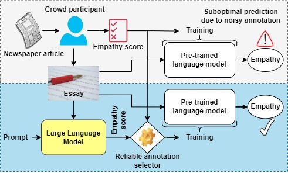

# LLM-GEm: Large Language Model-Guided Prediction of People's Empathy Levels towards Newspaper Article
This repository contains the implementation of our above paper accepted at the EACL 2024 conference.

Paper link: [PDF](https://hasan-rakibul.github.io/pdfs/hasan2024LLM-GEm.pdf)

# Abstract
Empathy – encompassing the understanding and supporting others' emotions and perspectives – strengthens various social interactions, including written communication in healthcare, education and journalism. Detecting empathy using AI models by relying on self-assessed ground truth through crowdsourcing is challenging due to the inherent noise in such annotations. To this end, we propose a novel system, named Large Language Model-Guided Empathy _(LLM-GEm)_ prediction system. It rectifies annotation errors based on our defined annotation selection threshold and makes the annotations reliable for conventional empathy prediction models, e.g., BERT-based pre-trained language models (PLMs). Previously, demographic information was often integrated numerically into empathy detection models. In contrast, our _LLM-GEm_ leverages GPT-3.5 LLM to convert numerical data into semantically meaningful textual sequences, enabling seamless integration into PLMs. We experiment with three _NewsEmpathy_ datasets involving people's empathy levels towards newspaper articles and achieve state-of-the-art test performance using a RoBERTa-based PLM.

# Overview
<br>
Fig: A typical empathy prediction workflow by directly utilising a PLM versus our proposed LLM-guided workflow. Because of the noise in crowdsourced data, a typical workflow often results in suboptimal prediction. Our proposed workflow employs LLM to refine or re define noisy annotations automatically and outperforms the typical approach.

&nbsp;
&nbsp;

<br>
Fig: _LLM-GEm_ system: we first use the LLM to convert demographic data to meaningful text. Essays and demographic sentences are used to annotate the essays using the LLM, and reliable annotations are then selected for each sample. After rephrasing the texts using the LLM, we train a RoBERTA-MLP model to predict empathy levels.


# Useful files and folders
- `*.sh`: bash scripts to train and test in all three datasets. **These are the primary scripts to train and test the proposed model.**
	- `train-test-v1-data.sh` are for the NewsEmpathy v1 dataset
	- `train-v2-data.sh` and `test-v2-data.sh` are for the NewsEmpathy v2 (WASSA 2022) dataset
	- `train-v3-data.sh` and `test-v3-data.sh` are for the NewsEmpathy v3 (WASSA 2023) dataset
- `./core/`: classes, methods and other functions used in above notebooks
	- `LLM-GEm-train.py`: train the model
		- By default, the code is ready for NewsEmpathy v3 (WASSA 2023) dataset. 
		- To execute for the NewsEmpathy v2 (WASSA 2022) dataset, `train-v2-data.sh` includes the changed arguments.
	- `LLM-GEm-test.py`: test the model. It select between LLM and crowdsource annotation and predict empathy levels using the RoBERTa-MLP model
		- By default, the code is ready for NewsEmpathy v3 (WASSA 2023) dataset. 
		- To execute for the NewsEmpathy v2 (WASSA 2022) dataset, `test-v2-data.sh` includes the changed arguments.
	- `evaluation.py`: official evaluation file from WASSA workshop, consisting of pearson r calculation
	- `kfold.py` and `kfold-v1-data.py`: 10-fold cross-validation-based empathy level prediction on the NewsEmpathy v1 dataset
- `annotation-by-LLM.ipynb`: access LLM (GPT-3.5) to annotate the essays
	- requires `openai-api.txt` file, consisting of the api
- `data-preprocessing.ipynb`: all preprocessing, including using LLM to convert numerical demographic to text, rephrase texts, etc.
	- requires `openai-api.txt` file, consisting of the api
- `roberta-basic.ipynb`: RoBERTa without any MLP to predict empathy levels without any demographic numbers. Used in ablation study.
- `analysis-and-plots.ipynb`: analysis on LLM annotation consistency and producing other plots
- `./data/`: processed datasets are available
	- raw dataset (including dev and test set) can be downloaded from the following places: NewsEmpathy v1 from [wwbp/empathic\_reactions](https://github.com/wwbp/empathic_reactions), NewsEmpathy v2 from [WASSA 2022](https://codalab.lisn.upsaclay.fr/competitions/834#learn_the_details-datasets) and NewsEmpathy v3 from [WASSA 2023](https://codalab.lisn.upsaclay.fr/competitions/11167#learn_the_details-datasets)
	<!-- - `./intermediate-files/`: generated during intermediate processing of the data but not required in the final training/validation/testing -->
	- **WS2\* and v1\* are the final preprocessed datasets (with GPT annotations) to be used in training**
- `*.tsv`: results from 10-fold cross-validation for the v1 dataset and different seed value for the v2 and v3 datasets
<!-- - Other folders in gitignore
	- `./ws22ckp/` and `./ws23ckp/`: to save checkpoints for the v2 and v3 datasets
	- `./tmp/`: temporary files of test results and zip file for submission to WASSA 2022 and 2023 -->
- `Vasava-2022-Transformer-modified/`: Codes here are taken from [https://github.com/notprameghuikey0913/WASSA-2022-Empathy-detection-and-Emotion-Classification](https://github.com/notprameghuikey0913/WASSA-2022-Empathy-detection-and-Emotion-Classification) and modified to test the performance of their model on our improved WASSA-2022 dataset.


# Software and Hardware
- Python 3.11.0 (see `requirements.txt` and `requirements_torch.txt` for packages)
- 1 NVIDIA Tesla V100 32GB GPU

# License
- The [v1 dataset](https://github.com/wwbp/empathic_reactions) is licensed under [CC BY 4.0](https://creativecommons.org/licenses/by/4.0/)
- The terms and conditions of [v2 dataset](https://codalab.lisn.upsaclay.fr/competitions/834#learn_the_details-datasets) and [v3 dataset](https://codalab.lisn.upsaclay.fr/competitions/11167#learn_the_details-datasets) includes the following statement: "The dataset should only be used for scientific or research purposes. Any other use is explicitly prohibited."
- Our processed datasets are released under the above same licenses and conditions of the original datasets
- Our codes are released under [CC BY 4.0](https://creativecommons.org/licenses/by/4.0/) license

# Glossary
- `anno-diff`: The annotation selection threshold (alpha)
- `dev_alpha`: False (default) means not to change validation annotation; True means change validation annotation using the threshold
- `mode`: 0 for LLM-GEm, 1 for LLM only and -1 for crowdsource annotation only

# If you find this repository useful, please cite our paper
```bibtex
@inproceedings{hasan2024llm-gem,
    title = {{LLM}-{GE}m: Large Language Model-Guided Prediction of People's Empathy Levels towards Newspaper Article},
    author = {Hasan, Md Rakibul and Hossain, Md Zakir and Gedeon, Tom and Rahman, Shafin},
    editor = {Graham, Yvette and Purver, Matthew},
    booktitle = {Findings of the Association for Computational Linguistics: EACL 2024},
    month = {3},
    year = {2024},
    pages = {2215--2231},
    address = {St. Julian{'}s, Malta},
    publisher = {Association for Computational Linguistics},
    url = {https://aclanthology.org/2024.findings-eacl.147}
}
```
